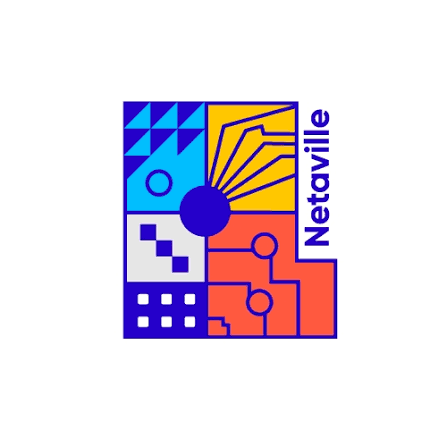

# Netaville

<p align="center">
  
</p>

<p align="center">
  <strong>Campus social app for coffee lovers, events, rewards, and community moments.</strong>
</p>

Netaville brings together the student experience in one polished mobile app: discover what is happening, request events, keep up with friends, track achievements, and stay connected to campus life.

## Highlights

- Event discovery and calendar views
- Friend activity and social engagement
- Event request flow for students and staff
- Reward progression with bronze, gold, and platinum ranks
- Clean mobile-first experience built with Expo + React Native
- Admin dashboard for managing displays, events, and content

## Screens and experience

### Mobile app

The main app lives in `netaville/` and is built around a campus lifestyle experience.

- Home and onboarding flow
- Authentication and verification screens
- Event request and RSVP journeys
- Friends, notifications, and profile experiences
- Calendar and activity discovery
- About, legal, and support information

### Admin panel

The staff experience lives in `netaville-admin/` and supports the operational side of Netaville:

- Event approvals and moderation
- TV display management and playlists
- Screen pairing and public signage workflow
- Shared schema and data model for app + admin use

## Screenshots

<p align="center">
  
  
  
</p>

These achievement visuals reflect the reward and progression system in the app.

## Tech stack

- React Native + Expo
- TypeScript
- Expo Router
- React Navigation
- Tailwind-style design system for the admin app
- Postgres-ready admin backend

## Project structure

```text
Netaville2.0/
├── netaville/             # Expo mobile app
│   ├── app/               # screens/routes
│   ├── src/               # shared app logic and theme
│   └── package.json
├── netaville-admin/       # admin dashboard
│   ├── app/               # Next.js admin pages
│   ├── db/                # database setup and schema
│   └── package.json
├── Netaville.png          # project logo
├── bronze.png             # rank asset
├── gold.png               # rank asset
├── platinum.png           # rank asset
├── netaville-intro.html   # animated intro concept
├── README.md
├── package.json           # root tooling
└── ...
```

## Quick start

### Mobile app

```bash
cd netaville
npm install
npm start
```

Then open in Android/iOS simulator or Expo Go.

### Admin app

```bash
cd netaville-admin
npm install
npm run dev
```

## Development notes

- The mobile app is designed for campus engagement and event-driven community interaction.
- The admin panel is intended to manage the system behind the scenes.
- The project is structured as a monorepo so the app and staff tooling evolve together.

## Why it feels good

Netaville is designed to feel clean, modern, and easy to use:

- Bold but readable visual language
- Friendly community-first interactions
- Strong hierarchy between content, actions, and rewards
- Smooth app flow from login to discovery to participation

---

<p align="center">
  <em>Built for campus community, events, and everyday connection.</em>
</p>
